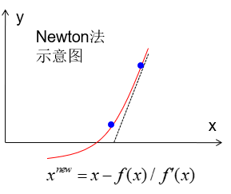

# 一维Riemann问题精确解
- 参考文献
   - 傅德薰、马延文 《计算流体力学》 P29-34
   - 李新亮， 《计算流体力学》课件 (PPT) 第 2 讲

---
### 问题描述
一维Riemann问题解析解(需用Newton方法非线性求解中心区压力)。

一维Euler方程，计算域为$x\in [-1,1]$。初始时刻($t=0$)物理量分布为：
$$(\rho,u,p)=\begin{cases}(\rho^L,u^L,p^L)&x<0\\(\rho^R,u^R,p^R)&x\le 0\end{cases} $$
需计算$t=t_0$时刻物理量的分布。

### 问题求解
1. 每个波控制方程组
- 激波：积分关系式：RH条件
- 膨胀波：等熵条件 + Riemann不变量
- 膨胀波内部区域：等熵条件 + Riemann不变量 + 特征相容关系
2. 求解单个波
- 对控制方程消元，得到关于中心区压力$p^*$的方程，用Newton法非线性求解$p^*$。得到$p^*$进而可得其他物理量。
消元的思路是假设$p^*$已知，先消$\rho^*$，再消$Z$。
- 具体推导过程参考: https://blog.csdn.net/meiguanhua/article/details/104454790

$$u_1-u_2=f(p^*,p_1,\rho_1)+f(p^*,p_2,\rho_2)\equiv F(p^*) $$

$$f(p^*,p_i,\rho_i)=\begin{cases}\dfrac{p^*-p_i}{\rho_ic_i\sqrt{\dfrac{\gamma+1}{2\gamma}\dfrac{p^*}{p_i}+\dfrac{\gamma-1}{2\gamma}}}&p^*>p_i&\text{激波}\\\dfrac{2c_i}{\gamma-1}\Big[\Big(\dfrac{p^*}{p_i}\Big)^{\frac{\gamma-1}{2\gamma}}-1\Big]&p^*<p_i&\text{膨胀波}\end{cases} $$

- PS：对双稀疏波中间真空的情况，$\rho^*=0$，声速无定义，稀疏波尾计算公式为（不大理解）：
  $$z_L^{\rm{tail}}=u_L+\frac{2c_L}{\gamma-1}\qquad z_R^{\rm{tail}}=u_R-\frac{2c_R}{\gamma-1} $$
- 牛顿法

$$f'(x)=\frac{f(x)-0}{x-x^{\rm{new}}} \Rightarrow x^{\rm{new}}=x-\frac{f(x)}{f'(x)} $$
- **无需判断波的类型分类讨论**，Newton迭代当前步的值已知，即可确定用分段函数的哪一支。总之先求中心区压力，其他物理量可随之得到。